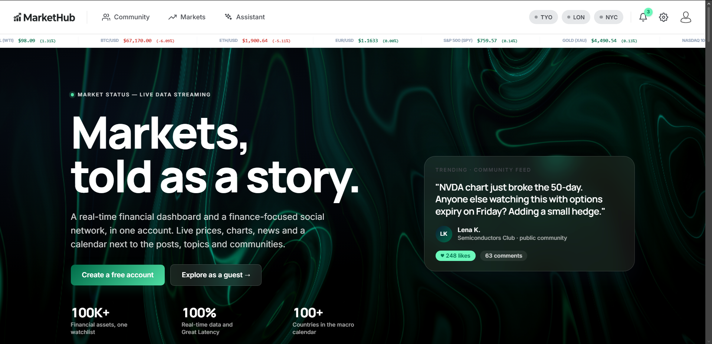
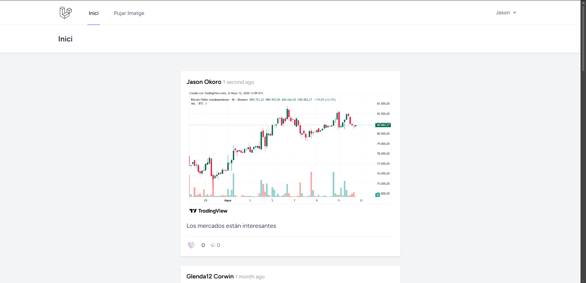
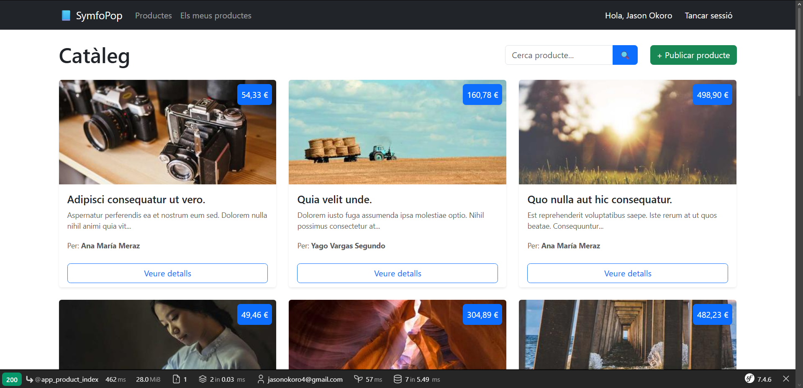
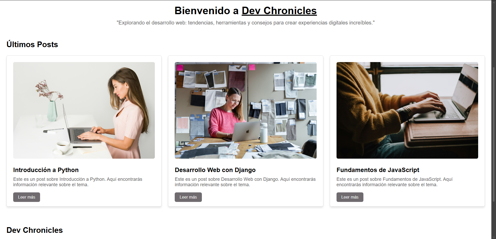

<div align="center">
  <h1>Hi there, I'm Jason Okoro 👋</h1>
  <h3>Full Stack Developer | Problem Solver | Tech Enthusiast</h3>
  
  <p>
    <a href="mailto:jasonokoro4@gmail.com"></a>
    <a href="https://github.com/jaasoon10"></a>
    <a href="https://maps.app.goo.gl/MLkeV9KCAgEs6x9a9"></a>
  </p>

<i>Desarrollador Full-Stack de 20 años con excelente expediente académico. Apasionado por las soluciones web escalables, aporto autonomía, pensamiento crítico y un aprendizaje rápido. Me destaco por mi comunicación efectiva y resolución lógica de problemas complejos.</i>

</div>

---

## 🚀 Sobre este Portfolio

Durante mi etapa en el Grado Superior (CFGS) en Desarrollo de Aplicaciones Web, he diseñado y programado multitud de sistemas y aplicaciones. Sin embargo, en este repositorio **he seleccionado y refinado exclusivamente mis 4 mejores proyectos**, los cuales reflejan mi dominio en diferentes arquitecturas y lenguajes demandados por la industria.

---

## 🌟 Proyecto Estrella: MarketHub

<div align="center">
  
  
  
  
  
</div>

**MarketHub** es el buque insignia de mi portfolio. Es una plataforma asíncrona robusta orientada a la comunidad e información de mercados, diseñada con una arquitectura de microservicios contenerizada.

- **Arquitectura SPA + API REST:** Frontend SPA ultrarrápido en Angular 17 conectado a un backend en Node.js/Express.
- **Base de Datos NoSQL:** Esquemas complejos de MongoDB, integrando pipelines de agregación.
- **Autenticación Segura:** JWT con Refresh Tokens, control de roles (User, Moderator, Superadmin) y SSO con Google OAuth 2.0.
- **DevOps & Infraestructura:** Entornos totalmente orquestados y automatizados mediante Docker y `docker-compose`.



---

## 📁 Otros Proyectos Destacados

Además de mi ecosistema JS/TS, domino el desarrollo MVC clásico con bases de datos relacionales y los ecosistemas más potentes de PHP y Python:

### 📸 Instagram Clone (Laravel)

Una réplica funcional orientada a las redes sociales.

- **Stack:** PHP 8, Laravel, MySQL, TailwindCSS.
- **Features:** Relaciones de bases de datos complejas (Followers/Following), subida y gestión de archivos multimedia, autenticación completa.



### 🎵 Symfopop (Symfony)

Plataforma de gestión desarrollada con uno de los frameworks más estrictos y empresariales del ecosistema PHP.

- **Stack:** PHP 8, Symfony, MySQL, Doctrine ORM.
- **Features:** Enrutamiento avanzado, Twig, inyección de dependencias y migraciones de base de datos seguras.



### 🐍 Blog Tech (Django)

Sistema de gestión de contenidos (CMS) rápido y eficiente.

- **Stack:** Python 3, Django 4, SQLite.
- **Features:** Panel de administración nativo integrado, ORM de Python, sistema de plantillas escalable.



---

## ⚙️ Cómo Ejecutar en Local (Localhost)

Para los desarrolladores o reclutadores que deseen probar los proyectos en sus máquinas locales, he aquí las instrucciones de despliegue rápido:

### 1. MarketHub (Docker)

Este proyecto está completamente dockerizado. Requiere tener Docker Desktop instalado.

```bash
cd MarketHub
docker-compose up --build
# Opcional: Poblar la base de datos con miles de posts y usuarios (Seeders)
docker-compose -p my_projects_markethub exec backend npm run seed:demo
```

- **Frontend:** `http://localhost:4200`
- **API Backend:** `http://localhost:3000`

### 2. Blog Tech (Django)

Requiere Python 3 instalado.

```bash
cd "Blog Django\my_site"
pip install -r requirements.txt
python manage.py runserver 8000
```

- **URL:** `http://localhost:8000`

### 3. Instagram Clone (Laravel)

Requiere PHP 8 y MySQL (ej: XAMPP). Asegúrate de encender MySQL en XAMPP.

```bash
cd "Projecte Laravel\instagram-clone"
composer install
php artisan serve --port=8001
```

- **URL:** `http://localhost:8001`

### 4. Symfopop (Symfony)

Requiere PHP 8 y MySQL.

```bash
cd "Projecte Symfony\symfopop"
composer install
php -S localhost:8002 -t public
```

- **URL:** `http://localhost:8002`

---

## 💻 Tech Stack & Habilidades

**🎨 Frontend**

- **Core:** HTML5, CSS3, JavaScript, TypeScript
- **Frameworks/Libs:** Angular, React.js, Next.js
- **Estilos:** Tailwind CSS, Bootstrap

**⚙️ Backend**

- **Ecosistema JS:** Node.js, Express.js
- **Ecosistema PHP:** PHP, Laravel, Symfony
- **Ecosistema Python:** Python, Django

**🗄️ Bases de Datos**

- **SQL:** MySQL, SQLite
- **NoSQL:** MongoDB

**🛠️ DevOps & CI/CD**

- **Control de Versiones:** Git, GitHub
- **Despliegue & Contenedores:** Docker, Kubernetes, Jenkins

---

## 💼 Experiencia Profesional

### Técnico Superior en Desarrollo de Aplicaciones Web | _Visio d'Enginyeria, SL_

_Junio 2025 - Enero 2026 (Prácticas)_

- Liderazgo único y autonomía total en el **rediseño integral** del portal corporativo [visio.cat](https://www.visio.cat).
- Desarrollo Full-Stack empleando PHP, MySQL, JavaScript y Bootstrap.
- Optimización profunda del rendimiento en entornos CMS (WordPress y Joomla).
- Reconocimiento explícito de la dirección ejecutiva por el salto de calidad del portal.

### Técnico Informático | _Centre de Formació Pràctica (CFP)_

_Abril 2023 - Noviembre 2023 (Prácticas)_

- Gestión, administración y soporte de infraestructura computacional y servidores.
- Mantenimiento preventivo y correctivo, asegurando el flujo continuo en el entorno empresarial IT.

---

## 🎓 Educación

- **CFGS Desarrollo de Aplicaciones Web (DAW)** | _Institut Lacetània_ (Sep 2024 - Jun 2026)
- **CFGM Sistemas Microinformáticos y Redes (SMR)** | _Institut Lacetània_ (Sep 2022 - Jun 2024)

---

## 🌍 Idiomas

- **Español:** Nativo
- **Catalán:** Nativo
- **Inglés:** Nativo

---

<div align="center">
  <i>No dudes en contactarme para oportunidades de colaboración, ofertas de empleo o si simplemente quieres hablar de tecnología.</i> <br>
  <b>📞 +34 640-23-95-66</b>
</div>

<br>

<div align="center">
  <small>© 2026 Jason Okoro. Todos los derechos reservados sobre los proyectos incluidos en este portfolio.</small>
</div>
